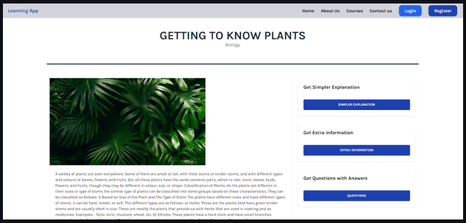

Personalized Education Platform

## Overview
The Personalized Education Platform is a web application built on Django and OpenAI, designed to revolutionize the way users access and interact with educational content. The platform enables users to personalize their learning experience by providing simplified explanations, additional information, and interactive question-and-answer features, all powered by AI.

## Features

- **Content Personalization**: Users can access educational content preloaded from textbooks and customize their learning journey.
- **Simplified Explanations**: AI-powered feature allows users to receive simplified explanations for complex topics at the click of a button.
- **Extra Information**: Users can access supplementary information and resources related to the content they are studying.
- **Question and Answer**: Interactive Q&A feature provides users with instant answers to their queries about the educational material.

## Technologies Used
- Django: Web framework for building the backend of the application.
- OpenAI: AI platform used for generating simplified explanations and answering user questions.
- HTML: Markup language for structuring the frontend of the application.
- Tailwind CSS: Utility-first CSS framework for styling the user interface.

## Installation
1. Clone the repository:
https://github.com/Akb-25/Generative-AI-Powered-Education-Platform

2. Install dependecies
pip install -r requirements.txt

3. Set up environment variables
- Navigate to edu and  
 Create a `.env` file in the project root directory.
- Add your OpenAI API key and other necessary credentials to the `.env` file.

## Usage
1. Start the Django server: 
python manage.py runserver

2. Open your web browser and navigate to `http://localhost:8000`.

3. Load the content you want to view and click on buttons to use AI features.

This project was worked on by :

Hareendiran N Akshay B Rex Joseph J Skanda K S
